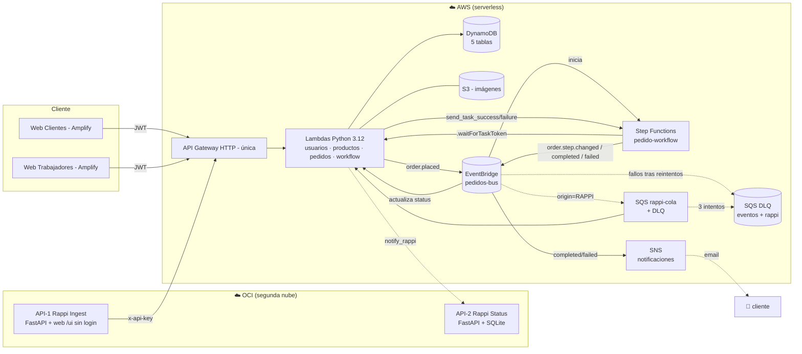

# 🍕 Sistema de Gestión de Pedidos — Papa Johns

**CS2032 · Cloud Computing (UTEC) — Proyecto Final · Grupo 2**
Arquitectura **serverless**, **multi-tenant**, **event-driven (EDA)** y **multi-nube (AWS + OCI)**.

### 👥 Integrantes (Grupo 2)
- Gala Vásquez, Danna Nickol
- Guevara Vargas, Eduardo Salvador
- Maguiña Quispe, Paul Ricardo
- Quispe Monzón, Oswaldo Alejandro
- Valverde Quispe, Maricielo Patricia

Sistema de gestión de pedidos de comida rápida inspirado en Papa Johns: los clientes ordenan
desde una web propia o desde un agregador externo tipo *Rappi* (alojado en otra nube), y cada
pedido recorre un flujo de trabajo humano (recibir → cocinar → empacar → repartir → entregar)
operado por los trabajadores del restaurante, con trazabilidad completa de estados, tiempos y
responsables, y un panel de administración por sede y una consola de cadena para el superadmin.

---

## 📑 Tabla de contenido
1. [Cumplimiento del enunciado](#-cumplimiento-del-enunciado)
2. [Arquitectura](#-arquitectura)
3. [Microservicios y dominios](#-microservicios-y-dominios)
4. [Modelo de datos (DynamoDB)](#-modelo-de-datos-dynamodb)
5. [API — endpoints](#-api--endpoints)
6. [Eventos (EventBridge) y workflow (Step Functions)](#-eventos-eventbridge-y-workflow-step-functions)
7. [Patrón Wait for Callback with Task Token](#-patrón-wait-for-callback-with-task-token)
8. [Mensajería asíncrona: SQS · DLQ · SNS](#-mensajería-asíncrona-sqs--dlq--sns)
9. [Multi-tenancy](#-multi-tenancy)
10. [Multi-nube: integración con OCI (Rappi)](#-multi-nube-integración-con-oci-rappi)
11. [Frontend](#-frontend)
12. [Seguridad](#-seguridad)
13. [Despliegue desde cero](#-despliegue-desde-cero)
14. [Suite de verificación (QA)](#-suite-de-verificación-qa)
15. [Observabilidad](#-observabilidad)
16. [Credenciales y URLs de demo](#-credenciales-y-urls-de-demo)
17. [Estructura del repositorio](#-estructura-del-repositorio)
18. [Decisiones de diseño y limitaciones conocidas](#-decisiones-de-diseño-y-limitaciones-conocidas)

---

## ✅ Cumplimiento del enunciado

| Requisito del enunciado | Cómo se cumple |
|---|---|
| Pedido desde **web propia** del cliente | App React en Amplify (`web-clientes`) con catálogo, carrito y seguimiento en tiempo real. |
| Pedido desde **API REST en otra nube** (Rappi) | API en **OCI** (contenedor) que gatilla el flujo en AWS. |
| **Workflow** atendido por trabajadores (cocinero → despachador → repartidor) | `web-trabajadores` + Step Functions con tareas humanas. |
| Atención **en orden de llegada (FIFO)** | Cola por GSI ordenada por `started_at`. |
| Si vino de Rappi, **actualizar estado en Rappi en cada paso** | EventBridge (filtro `origin=RAPPI`) → cola **SQS** → Lambda `notify_rappi` llama a la 2da API en OCI. |
| Estado del workflow, **tiempos de inicio/fin y quién atendió** + **dashboard** | Vista Pedidos (Kanban), timeline por pedido y Dashboard con gráficos. |
| **Multi-tenancy, serverless, EDA, multi-nube** | Modelo pool por `tenant_id`; 100% Lambda; EventBridge; AWS + OCI. |
| **Mínimo 3 microservicios** | 4 dominios: usuarios, productos, pedidos, workflow (cada uno con su tabla). |
| Servicios AWS obligatorios: **Amplify, API Gateway, EventBridge, Step Functions, Lambda, DynamoDB, S3** | Todos en uso. |
| Patrón **Wait for Callback with Task Token** | Cada paso humano del workflow lo usa. |
| **Framework serverless** para el backend | Serverless Framework v4. |
| Web y catálogo **parecidos a la referencia** | Estética Papa Johns (verde/rojo/crema) + modo oscuro. |

**Más allá de lo pedido** (robustez y UX): mensajería asíncrona con **SQS** (cola amortiguadora),
**DLQ** (resiliencia, no se pierde ningún evento) y **SNS** (notificaciones al cliente, pub/sub);
consola de administración por sede (personal, productos, roles), consola de **SUPERADMIN** de cadena
con métricas y gestión de sedes; **web de Rappi sin login alojada en OCI** (`/ui`); web de clientes con
navegación por secciones (Menú, Promos, Locales, Rastrea, Nosotros); cancelación de pedidos (lado de
*fallo* del Task Token), tablero **Kanban en vivo**, gráficos con Recharts, modo oscuro, búsqueda/filtros,
validación de precios en el servidor y una **suite de QA** automatizada.

---

## 🏗 Arquitectura



**Flujo completo de un pedido (origen Rappi, el caso más completo):**
1. Rappi hace `POST /orders` a **OCI API-1**, que registra el pedido y llama a `POST /pedidos/rappi` en AWS (con `x-api-key`).
2. La Lambda valida contra el catálogo, guarda en `t_pedidos` (`RECEIVED`) y publica `order.placed` en **EventBridge**.
3. Una regla dispara la Lambda que **inicia la ejecución de Step Functions**.
4. El workflow entra a *Cocinar* con `.waitForTaskToken`: se guarda el token en `t_workflow` y, como `origin=RAPPI`, `notify_rappi` actualiza el estado en **OCI API-2**.
5. El cocinero **toma** y **completa** desde `web-trabajadores` → `send_task_success` → el workflow avanza a *Empacar*, *Repartir*, *Entregar* (mismo patrón en cada paso).
6. Al finalizar, el pedido queda `DELIVERED`, se publica `order.completed` y se notifica a Rappi por última vez.
7. El cliente ve el avance en su tracker (polling) y los trabajadores en el Kanban en vivo; el dashboard agrega tiempos y responsables.

---

## 🧩 Microservicios y dominios

El backend es **un solo servicio Serverless** desplegable con un comando y con **una sola API Gateway**,
organizado internamente en **4 dominios de negocio**, cada uno con su **propia tabla DynamoDB** y sus
handlers. Se comunican **por eventos** (EventBridge), nunca por llamadas directas — eso preserva el
desacoplamiento de microservicios y la arquitectura event-driven.

| Dominio | Responsabilidad | Tabla | Handlers |
|---|---|---|---|
| **usuarios** | Registro/login, JWT, authorizer, gestión de personal (admin) | `t_usuarios` | `usuarios.py`, `authorizer.py`, `jwt_utils.py` |
| **productos** | Catálogo (CRUD), imágenes en S3, seed | `t_productos` | `productos.py`, `seed_data.py` |
| **pedidos** | Crear (web/Rappi), consultar, eventos, sincronizar estado | `t_pedidos` | `pedidos.py` |
| **workflow** | Step Functions, task tokens, tareas humanas, dashboard, cancelación, sedes/métricas | `t_workflow`, `t_sedes` | `workflow.py`, `tareas.py`, `sedes.py` |

> Nota: la consolidación en un único `serverless.yml` + una sola API Gateway fue una mejora pedida
> en revisión; los dominios siguen siendo microservicios lógicos con BD propia, lo que mantiene el
> requisito de “mínimo 3 microservicios” y “diseño de BD de cada microservicio”.

---

## 🗄 Modelo de datos (DynamoDB)

Diseño *single-table por dominio*, con claves compuestas y prefijo de tenant para el aislamiento.

### `t_usuarios`
| Atributo | Descripción |
|---|---|
| `PK` = `TENANT#<sede>` · `SK` = `USER#<email>` | clave |
| `email`, `nombre`, `role`, `titulo`, `salt`, `password_hash` | datos (rol ∈ CLIENTE, COCINERO, DESPACHADOR, REPARTIDOR, ADMIN, SUPERADMIN) |

### `t_productos`
| Atributo | Descripción |
|---|---|
| `PK` = `TENANT#<sede>` · `SK` = `PROD#<id>` | clave |
| `product_id`, `nombre`, `categoria`, `precio`, `descripcion`, `image_url` (a S3) | datos |

### `t_pedidos`
| Atributo | Descripción |
|---|---|
| `PK` = `TENANT#<sede>` · `SK` = `ORDER#<id>` | clave |
| `GSI1PK` = `TENANT#<sede>#STATUS#<estado>` · `GSI1SK` = `created_at` | **GSI1**: cola FIFO por estado |
| `origin` (WEB/RAPPI), `status`, `items[]`, `total`, `cliente`, `created_at` | datos |

### `t_workflow`
| Atributo | Descripción |
|---|---|
| `PK` = `TENANT#<sede>#ORDER#<id>` · `SK` = `STEP#<paso>` | clave |
| `GSI1PK` = `TENANT#<sede>#STEP#<paso>#STATUS#<estado>` · `GSI1SK` = `started_at` | **GSI1**: cola FIFO por rol/paso |
| `GSI2PK` = `TENANT#<sede>` · `GSI2SK` = `started_at` | **GSI2**: dashboard por sede (evita `scan`) |
| `task_token`, `status`, `started_at`, `taken_at`, `finished_at`, `worker_id`, `worker_name`, `items_resumen` | datos |

### `t_sedes`
| Atributo | Descripción |
|---|---|
| `PK` = `SEDE` · `SK` = `<id-sede>` | clave |
| `id`, `nombre`, `direccion`, `activa`, `created_at` | datos |

> **Optimización scan → query:** el dashboard se calculaba con un `scan` filtrado (O(n) sobre toda la
> tabla). Se añadió el índice **GSI2** (`TENANT#<sede>`) para resolverlo con un `query` directo a la
> partición de la sede, reduciendo latencia y RCUs.

---

## 🔌 API — endpoints

Todos bajo **una sola API Gateway**. `[JWT]` = requiere token; `[api-key]` = header `x-api-key`; resto público.

**Auth y usuarios**
- `POST /auth/register` — registro de cliente (siempre crea CLIENTE)
- `POST /auth/login` — login (devuelve JWT)
- `GET /auth/me` `[JWT]`
- `GET /usuarios` · `POST /usuarios` · `PATCH /usuarios/{email}` · `DELETE /usuarios/{email}` `[JWT, ADMIN]`

**Productos**
- `GET /productos?tenant_id=<sede>` — catálogo (público)
- `POST /productos` · `PATCH /productos/{id}` · `DELETE /productos/{id}` `[JWT, ADMIN]`

**Sedes**
- `GET /sedes` — sedes activas (público; alimenta el selector de las webs)
- `POST /sedes` · `PATCH /sedes/{id}` · `GET /sedes/metricas` `[JWT, SUPERADMIN]`

**Pedidos**
- `POST /pedidos` `[JWT]` — desde la web propia
- `POST /pedidos/rappi` `[api-key]` — desde OCI (Rappi)
- `GET /pedidos` · `GET /pedidos/{id}` `[JWT]`
- `POST /pedidos/{id}/cancelar` `[JWT]` — cancela (lado de fallo del Task Token)

**Workflow / tareas**
- `GET /tareas?paso=&status=` `[JWT]` — cola FIFO por rol
- `POST /tareas/{id}/{paso}/tomar` · `POST /tareas/{id}/{paso}/completar` `[JWT]`
- `GET /tareas/{id}` `[JWT]` — timeline del pedido
- `GET /dashboard` `[JWT]` — métricas de la sede

---

## 📨 Eventos (EventBridge) y workflow (Step Functions)

Bus: **`pedidos-bus`** (creado por el propio `sls deploy`).

| Evento (`detail-type`) | Source | Productor | Consumidores |
|---|---|---|---|
| `order.placed` | `ms.pedidos` | crear pedido | `start_workflow` (inicia Step Functions) |
| `order.step.changed` | `ms.workflow` | cada paso | `actualizar_status` · `encolar_rappi` (si `origin=RAPPI` → SQS) |
| `order.completed` | `ms.workflow` | fin del flujo | `actualizar_status` (→ DELIVERED) · `encolar_rappi` · `notificar_cliente` (SNS) |
| `order.failed` | `ms.workflow` | timeout/cancelación | `actualizar_status` (→ FAILED) · `encolar_rappi` · `notificar_cliente` (SNS) |

Los consumidores internos (`start_workflow`, `actualizar_status`) tienen **DLQ + reintentos**; las
notificaciones a Rappi pasan por **SQS** (`encolar_rappi` → cola → `notify_rappi`). Ver la sección siguiente.

**State machine** (`pedido-workflow`, tipo *Standard*):

```
EsperarCocina → EsperarEmpaque → EsperarReparto → EsperarEntrega → Finalizar
   (cada "Esperar*" usa .waitForTaskToken, TimeoutSeconds 86400)
   Catch States.ALL → NotificarFallo → PedidoFallido
```

---

## ⏸ Patrón Wait for Callback with Task Token

Cada paso humano del workflow se modela con `arn:aws:states:::lambda:invoke.waitForTaskToken`:

1. **Entrada al paso:** Step Functions invoca `asignar_tarea` pasando `$$.Task.Token`. La Lambda
   guarda el token en `t_workflow` (estado `PENDING`), registra el resumen de ítems y, si el pedido
   vino de Rappi, notifica a OCI. Al retornar, **la ejecución queda pausada sin costo**.
2. **Callback humano (éxito):** el trabajador pulsa *Completar* → la Lambda recupera el token y llama
   `send_task_success` → el workflow avanza al siguiente paso.
3. **Callback de fallo:** la **cancelación** de un pedido llama `send_task_failure` sobre el token del
   paso activo → el `Catch` lleva a `NotificarFallo` → evento `order.failed` → pedido `FAILED` y Rappi
   notificado. Así se demuestran **ambos lados** del patrón, no solo el camino feliz.

---

## 📦 Mensajería asíncrona: SQS · DLQ · SNS

La arquitectura es **desacoplada y asíncrona**: los dominios se comunican por eventos (EventBridge) y el
workflow humano es asíncrono de larga duración (Step Functions + Task Token). Sobre esa base se añaden tres
piezas con casos de uso concretos:

**SQS — cola amortiguadora hacia la nube externa.**
Las notificaciones a Rappi no llaman a OCI directamente: `order.*` con `origin=RAPPI` → Lambda
`encolar_rappi` → **cola SQS `rappi-cola`** → Lambda `notify_rappi` → OCI. Esto **desacopla AWS de la
disponibilidad de OCI**: si OCI está lento o caído, los mensajes se acumulan y se reintentan; cuando OCI
vuelve, se procesan solos.

**DLQ — resiliencia (no se pierde ningún evento).**
- `rappi-cola` tiene una **DLQ `rappi-dlq`**: tras 3 intentos fallidos contra OCI, el mensaje se conserva
  ahí para inspección/reproceso (en vez de perderse).
- Los consumidores internos de EventBridge (`start_workflow`, `actualizar_status`) tienen
  `retryPolicy` + **`eventos-dlq`** como destino de fallo.

**SNS — notificaciones salientes (pub/sub fan-out).**
Al entregarse o cancelarse un pedido, `notificar_cliente` publica en el topic **`pedidos-notificaciones`**;
un suscriptor de **email** recibe el aviso. El topic admite más suscriptores (SMS, otra cola) sin tocar el
productor — eso es *fan-out*.

> Modelo mental: **EventBridge** = eventos internos · **SQS** = amortiguar/desacoplar hacia lo externo ·
> **DLQ** = no perder nada · **SNS** = notificar a personas.

---

## 🏢 Multi-tenancy

Modelo **pool** (una infraestructura compartida, datos aislados por tenant):
- El `tenant_id` (la sede) viaja en el **claim del JWT**; el Lambda authorizer lo inyecta en el contexto.
- **Todas** las PK de DynamoDB empiezan con `TENANT#<sede>`; ninguna query cruza tenants.
- Los handlers **nunca** toman el tenant del body (salvo el ingest de Rappi, que lo mapea vía `x-api-key`).
- 4 sedes demo: `pj-miraflores`, `pj-surco`, `pj-san-isidro`, `pj-la-molina`, más `pj-central` (superadmin).
- Las sedes son **dinámicas**: se crean/activan/desactivan desde la consola del superadmin y aparecen
  automáticamente en el selector de ambas webs (vía `GET /sedes`).

---

## 🌐 Multi-nube: integración con OCI (Rappi)

La segunda nube es **Oracle Cloud Infrastructure**. Dos APIs REST en **contenedores Docker** (FastAPI)
corriendo sobre una VM Oracle Linux, con **SQLite** como almacén de “Rappi”:

- **API-1 `rappi-ingest`** (`:8000`): simula a Rappi; recibe el pedido y gatilla el workflow en AWS.
  Además sirve una **web de demo sin login en `/ui`** (`http://<IP_OCI>:8000/ui`) para mostrar el flujo
  multi-nube en el navegador (elegir pizza → pedir → ver el estado avanzar en vivo).
- **API-2 `rappi-status`** (`:8001`): recibe de AWS la actualización de estado en **cada paso** y la
  persiste; expone `GET /orders/{id}` para evidenciar el estado “en Rappi”.

La integración es por **contratos REST + API key**, totalmente desacoplada: AWS notifica vía EventBridge
→ **SQS** → `notify_rappi`. Ambos contenedores tienen CORS habilitado para que la web `/ui` consulte el
estado. Detalle de despliegue en [`oci/README.md`](oci/README.md).

---

## 💻 Frontend

Dos SPAs en **React + Vite**, desplegadas en **Amplify Hosting** (monorepo), con un *design system*
compartido (paleta Papa Johns, tipografías Poppins/Inter, **modo claro/oscuro**, iconos Lucide).

**`web-clientes`** — navegación por secciones en la barra superior:
- **Menú:** catálogo por categorías, carrito (drawer animado), checkout.
- **Promos exclusivas:** combos sugeridos que se agregan al carrito.
- **Locales:** las sedes con su dirección (desde `GET /sedes`); permite cambiar de local.
- **Rastrea tu pedido:** lista de pedidos del cliente + **tracker** con stepper animado en tiempo real.
- **Nosotros:** sección institucional.
Incluye login/registro, cancelación de pedidos y modo claro/oscuro.

**`web-trabajadores`** — consola de operaciones con **sidebar**:
- **Mis tareas:** cola FIFO por rol, con los productos a preparar; tomar/completar.
- **Pedidos:** **tablero Kanban en vivo** (las tarjetas se mueven solas al avanzar el workflow), con
  búsqueda por id/cliente/origen/producto y timeline con tiempo total por pedido.
- **Dashboard:** gráficos con **Recharts** (tiempo por paso, pedidos por estado, ranking de trabajadores).
- **Administración (ADMIN):** gestión de **personal** (crear, asignar rol y título, buscar/filtrar),
  **productos** (CRUD) y referencia de **roles**.
- **Consola de cadena (SUPERADMIN):** KPIs y gráficos comparativos por sede + gestión de sedes.

---

## 🔐 Seguridad

- **JWT HS256** firmado con un secreto compartido en `shared-config.yml` (**gitignored**; plantilla en
  `shared-config.example.yml`). Lambda authorizer valida el token e inyecta `tenant_id`/`role`.
- **RBAC:** cada rol solo atiende sus pasos; `/usuarios` y `/productos` solo ADMIN; `/sedes` solo SUPERADMIN.
- **Anti-escalada:** el registro público **siempre crea CLIENTE** (ignora el rol del body); un ADMIN de
  sede no puede crear/ascender a SUPERADMIN.
- **Precio del servidor:** al crear un pedido, el precio y el nombre se toman **del catálogo**, nunca del
  body — evita manipulación de precios.
- **Privacidad:** un CLIENTE solo ve sus propios pedidos. La API de Rappi usa `x-api-key` y nunca confía
  en el body para la identidad.

---

## 🚀 Despliegue desde cero

**Requisitos:** Node 18+, `npm i -g serverless`, credenciales AWS (Learner Lab → renovar cada sesión),
y cuenta OCI para la parte multi-nube.

### AWS (backend + datos)
```bash
# 0. Secretos (una vez) — NO se sube al repo
cp backend/shared-config.example.yml backend/shared-config.yml
nano backend/shared-config.yml          # jwtSecret, rappiApiKey, rappiStatusUrl

# 1. UN solo deploy crea TODO: API Gateway única, 5 tablas, bus, Step Functions
cd backend && sls deploy

# 2. Cargar datos demo
sls invoke -f seedSedes        # 4 sedes
sls invoke -f seedProductos    # catálogo (12 productos × sede)
sls invoke -f seedUsuarios     # 45 cuentas (11 por sede + superadmin)
cd ..

# 3. Imágenes del catálogo a S3
aws s3 cp ./images s3://pj-grupo2-imagenes-<ACCOUNT_ID>/ --recursive
```

### OCI (Rappi) — resumen (detalle en `oci/README.md`)
```bash
# VCN con subred pública + Security List abriendo TCP 8000 y 8001 · VM Oracle Linux 9
sudo dnf install -y docker git && sudo loginctl enable-linger opc
git clone <repo> && cd pruebascloud
docker network create rappi-net
cd oci/rappi-status && docker build -t rappi-status . && cd ../..
docker run -d --name rappi-status --network rappi-net -p 8001:8000 -e API_KEY=<rappiApiKey> rappi-status
cd oci/rappi-ingest && docker build -t rappi-ingest . && cd ../..
docker run -d --name rappi-ingest --network rappi-net -p 8000:8000 \
  -e API_KEY=<rappiApiKey> -e AWS_PEDIDOS_URL=<URL_API> -e STATUS_URL=http://rappi-status:8000 rappi-ingest
sudo firewall-cmd --permanent --add-port=8000/tcp --add-port=8001/tcp && sudo firewall-cmd --reload
# Auto-arranque tras reinicio de la VM:
(crontab -l 2>/dev/null; echo "@reboot sleep 20 && /usr/bin/docker start rappi-status rappi-ingest") | crontab -
```
Luego en AWS: poner `rappiStatusUrl: http://<IP_OCI>:8001` en `shared-config.yml` y `cd backend && sls deploy`.
La **web de Rappi sin login** queda en `http://<IP_OCI>:8000/ui` (el `Dockerfile` del ingest copia `static/`).
Tras desplegar el backend, **confirmar la suscripción de email de SNS** (AWS envía un correo de confirmación).

### Frontend (Amplify)
1. Poner la **URL de la API** en `API_BASE` de `frontend/web-clientes/src/config.js` y
   `frontend/web-trabajadores/src/config.js`, y en `BASE` de `scripts/config.sh`. Push.
2. En Amplify Hosting: crear **2 apps** (monorepo) con appRoot `frontend/web-clientes` y
   `frontend/web-trabajadores` (el `amplify.yml` ya define el build).

---

## 🧪 Suite de verificación (QA)

Suite automatizada en `scripts/` para validar que todo quedó bien levantado (ver `scripts/README.md`):

```bash
bash scripts/run-all.sh         # corre todo y da un banner verde/rojo
```
- **check-health** — credenciales, API viva, login, endpoint protegido, OCI, y que el `config.js` del frontend apunte a la API correcta.
- **smoke-test** — pedido WEB end-to-end hasta `DELIVERED`.
- **test-security** — RBAC, anti-escalada y precio del servidor.
- **test-multinube** — AWS ↔ OCI (Rappi) + cancelación (se omite si OCI no es accesible desde la red).
- **demo-multinube** — `bash scripts/demo-multinube.sh`: demo de un comando del flujo AWS↔OCI (para presentar).

---

## 🔭 Observabilidad

- **Logs:** CloudWatch → `/aws/lambda/pedidos-pj-dev-<función>`.
- **Workflow:** consola Step Functions → `pedido-workflow-dev` (grafo, estado, tiempos por paso).
- **Eventos:** EventBridge → bus `pedidos-bus` (métricas Invocations / FailedInvocations).
- **Colas:** SQS → `rappi-cola`, `rappi-dlq`, `eventos-dlq` (`ApproximateNumberOfMessages`); si una DLQ
  sube de 0, hubo fallos capturados (no perdidos).
- **Notificaciones:** SNS → topic `pedidos-notificaciones` (suscripciones y entregas).
- **Negocio:** `GET /dashboard` y la vista Dashboard (gráficos) + la consola de cadena del superadmin.
- **Estado en Rappi:** `GET http://<IP_OCI>:8001/orders/{id}` muestra el historial de pasos en OCI.

---

## 🔑 Credenciales y URLs de demo

**API Gateway (única):** `https://i9m3hyluue.execute-api.us-east-1.amazonaws.com`
**OCI (Rappi):** `http://163.192.123.104` (ingest `:8000`, status `:8001`)

> Las URLs cambian si se recrea el stack o la VM. Tras un `sls deploy` que cambie la URL, actualizar los
> `config.js` de los frontends y `scripts/config.sh`.

**Cuentas demo** (password `123456`):

| Rol | Email | Sede |
|---|---|---|
| Cocinero | `cocinero@pj.com` | cualquier sede |
| Despachador | `despachador@pj.com` | cualquier sede |
| Repartidor | `repartidor@pj.com` | cualquier sede |
| Admin de sede | `admin@pj.com` | cualquier sede |
| **Superadmin** | `superadmin@pj.com` | **Central (cadena)** |

Cada sede tiene además personal adicional con nombres reales y títulos (Jefe de cocina, Empleado del mes, etc.).

---

## 📂 Estructura del repositorio

```
.
├── backend/
│   ├── serverless.yml              # UN servicio: API única + 5 tablas + Step Functions + bus
│   ├── shared-config.example.yml   # plantilla de secretos (la real está gitignored)
│   ├── authorizer.py  jwt_utils.py # auth compartida (JWT + Lambda authorizer)
│   ├── usuarios.py                 # auth + gestión de personal (admin)
│   ├── productos.py  seed_data.py  # catálogo + seeds
│   ├── pedidos.py                  # pedidos (web/Rappi) + eventos
│   ├── workflow.py  tareas.py      # Step Functions, task tokens, tareas, dashboard, cancelación
│   └── sedes.py                    # sedes dinámicas + métricas de cadena (superadmin)
├── frontend/
│   ├── web-clientes/               # SPA cliente (secciones: Menú/Promos/Locales/Rastrea/Nosotros)
│   └── web-trabajadores/           # consola operaciones + admin + superadmin
├── images/                         # catálogo: pizzas/ complementos/ bebidas/ postres/
├── oci/
│   ├── rappi-ingest/               # API-1 (FastAPI) + static/index.html (web /ui sin login)
│   ├── rappi-status/               # API-2 (FastAPI + SQLite)
│   └── README.md                   # despliegue OCI + web de demo
├── scripts/                        # suite QA: config.sh, lib.sh, run-all, check-health,
│   │                               #   smoke-test, test-security, test-multinube, demo-multinube
│   └── README.md
├── amplify.yml                     # build monorepo de los 2 frontends
└── README.md
```

---

## 🧭 Decisiones de diseño y limitaciones conocidas

- **JWT propio (no Cognito):** suficiente para el alcance y evita dependencias; el secreto está fuera del repo.
- **Polling (no WebSockets):** el cliente sondea el estado cada 5 s; se eligió por simplicidad. Una
  evolución natural sería *push* con API Gateway WebSocket.
- **SNS email (no SMS):** las notificaciones salen por email. El topic admite SMS como suscriptor
  (mismo patrón), pero el envío de SMS en el Learner Lab está en *sandbox*/restringido, así que se deja
  como capacidad de diseño y no se usa en vivo.
- **Soft-delete de sedes:** desactivar una sede la oculta de los selectores pero **conserva sus datos**
  (evita pedidos huérfanos).
- **Métricas del superadmin sin paginación:** a escala de demo el `query` por sede cabe en una página;
  con decenas de miles de pedidos habría que paginar.
- **Reproducibilidad probada:** el sistema se reconstruyó por completo desde cero (repo + VM + secretos +
  4 deploys → un deploy consolidado) y la suite QA pasó de punta a punta.

---

*Proyecto académico — CS2032 Cloud Computing, UTEC. Referencia de marca: Papa Johns (papajohns.com.pe).*
