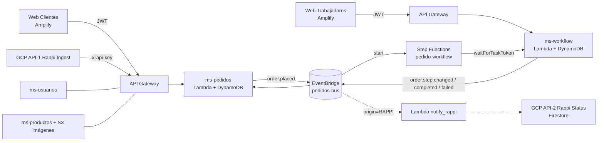

# Sistema de Gestión de Pedidos — Papa Johns (Grupo 2)
**CS2032 Cloud Computing · Arquitectura serverless, multi-tenant, event-driven, multi-nube (AWS + GCP)**

## Arquitectura



## Microservicios

| Servicio | Responsabilidad | Tabla | Endpoints clave |
|---|---|---|---|
| ms-usuarios | Auth multi-tenant, JWT, authorizer | t_usuarios | POST /auth/register, /auth/login, GET /auth/me |
| ms-productos | Catálogo + imágenes S3 | t_productos | GET/POST /productos |
| ms-pedidos | Pedidos (web/Rappi), eventos | t_pedidos | POST /pedidos, POST /pedidos/rappi, GET /pedidos[/{id}] |
| ms-workflow | Step Functions, task tokens, dashboard | t_workflow | GET/POST /tareas..., GET /dashboard |

**Flujo de un pedido:** `POST /pedidos` → evento `order.placed` → Step Functions inicia → cada paso humano (COCINAR→EMPACAR→REPARTIR→ENTREGAR) pausa con *Wait for Callback with Task Token*; el trabajador completa vía API → `send_task_success` → avanza. Cada transición publica `order.step.changed` (consumido por ms-pedidos para actualizar status; si origin=RAPPI, también notifica a GCP).

**Multi-tenancy (modelo pool):** `tenant_id` en el claim del JWT y como prefijo de todas las PK (`TENANT#...`). El authorizer inyecta el tenant; ningún handler lo acepta del body.

## Despliegue desde cero (reproducible)

Requisitos: Node 18+, `npm i -g serverless`, credenciales AWS en `~/.aws/credentials` (Learner Lab: renovar cada sesión).

```bash
# 0. Secretos (una vez): copiar y editar (este archivo NO se sube al repo)
cp backend/shared-config.example.yml backend/shared-config.yml
nano backend/shared-config.yml

# 1. Bus de eventos (una vez)
aws events create-event-bus --name pedidos-bus

# 2. Microservicios EN ESTE ORDEN (anotar la URL que devuelve cada deploy)
cd backend/ms-usuarios  && sls deploy && cd ../..
cd backend/ms-productos && sls deploy && sls invoke -f seed && cd ../..
cd backend/ms-pedidos   && sls deploy && cd ../..
cd backend/ms-workflow  && sls deploy && cd ../..

# 3. Subir imágenes del catálogo
aws s3 cp ./images s3://pj-grupo2-imagenes-<ACCOUNT_ID>/ --recursive

# 4. Frontends: poner las URLs de los deploys en frontend/*/src/config.js
#    y en scripts/smoke-test.sh; push; conectar el repo en Amplify Hosting
#    (2 apps monorepo: appRoot frontend/web-clientes y frontend/web-trabajadores)

# 5. Usuarios demo + prueba end-to-end automática
bash scripts/smoke-test.sh
```

Estructura del repositorio:

```
├── backend/
│   ├── shared-config.example.yml   (plantilla de secretos)
│   ├── ms-usuarios/  ms-productos/  ms-pedidos/  ms-workflow/
├── frontend/
│   ├── web-clientes/  web-trabajadores/
├── images/            (catálogo: pizzas/ complementos/ bebidas/ postres/)
├── scripts/smoke-test.sh
├── amplify.yml
└── README.md
```

> Nota Learner Lab: las URLs de API Gateway cambian solo si se recrea el stack. Si pasa, actualizar `config.js` de ambos frontends y `scripts/smoke-test.sh`.

## URLs actuales (dev)

| Servicio | URL |
|---|---|
| ms-usuarios | https://urvrhgysm5.execute-api.us-east-1.amazonaws.com |
| ms-productos | https://sqzem7pezh.execute-api.us-east-1.amazonaws.com |
| ms-pedidos | https://os2ehl7kg2.execute-api.us-east-1.amazonaws.com |
| ms-workflow | https://s1fn3k0udc.execute-api.us-east-1.amazonaws.com |

Usuarios demo (tenant `pj-miraflores`, password `123456`): `cocinero@pj.com`, `despachador@pj.com`, `repartidor@pj.com`.

## Observabilidad

- **Logs**: CloudWatch → `/aws/lambda/ms-<servicio>-dev-<función>` (cada handler hace `print` de los eventos clave).
- **Workflow**: consola Step Functions → `pedido-workflow-dev` → cada ejecución muestra el grafo, estado actual, historial de eventos y tiempos por paso.
- **Eventos**: EventBridge → bus `pedidos-bus` → las reglas muestran métricas de invocación (Invocations / FailedInvocations).
- **Negocio**: `GET /dashboard` (tiempos promedio por paso, tareas por estado, ranking de trabajadores) y vista Dashboard en la web de trabajadores.
- **Errores del workflow**: si una tarea humana falla o expira (24h), el flujo pasa por `NotificarFallo` → evento `order.failed` → pedido en estado `FAILED` (visible en ambas webs).

## Seguridad

- JWT HS256 firmado con secreto compartido vía `shared-config.yml` (gitignored; ver `shared-config.example.yml`).
- Lambda authorizer en cada microservicio; roles: CLIENTE, COCINERO, DESPACHADOR, REPARTIDOR, ADMIN.
- Un CLIENTE solo ve sus propios pedidos; cada rol solo puede atender sus pasos.
- API Rappi protegida con `x-api-key` (mapea a un tenant, nunca confía en el body para identidad).
